<div align="center">

# 🎄 Advent of Code


My solution for [Advent of Code](https://adventofcode.com) puzzles written in Kotlin. <br>
I collect all my solutions from all AoCs in this single repository.

</div>

---

## 🗓️ Calender Current Year 2025

<!-- AOC TILES BEGIN -->
<table align="center">
  <tr>
    <td align="center">
        <a href="https://adventofcode.com/2025/day/1">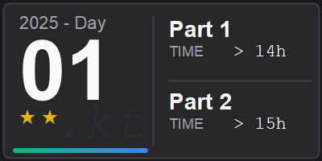</a> <br/>
        <a href="src/main/kotlin/tr/emreone/adventofcode/year2025/Day01.kt">Day01.kt</a> |
        <a href="src/test/kotlin/tr/emreone/adventofcode/year2025/Day01Test.kt">Day01Test.kt</a>
    </td>
    <td align="center">
        <a href="https://adventofcode.com/2025/day/2">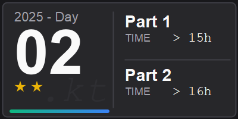</a> <br/>
        <a href="src/main/kotlin/tr/emreone/adventofcode/year2025/Day02.kt">Day02.kt</a> |
        <a href="src/test/kotlin/tr/emreone/adventofcode/year2025/Day02Test.kt">Day02Test.kt</a>
    </td>
    <td align="center">
        <a href="https://adventofcode.com/2025/day/3">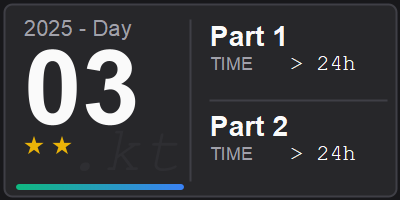</a> <br/>
        <a href="src/main/kotlin/tr/emreone/adventofcode/year2025/Day03.kt">Day03.kt</a> |
        <a href="src/test/kotlin/tr/emreone/adventofcode/year2025/Day03Test.kt">Day03Test.kt</a>
    </td>
    <td align="center">
        <a href="https://adventofcode.com/2025/day/4">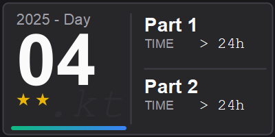</a> <br/>
        <a href="src/main/kotlin/tr/emreone/adventofcode/year2025/Day04.kt">Day04.kt</a> |
        <a href="src/test/kotlin/tr/emreone/adventofcode/year2025/Day04Test.kt">Day04Test.kt</a>
    </td>
    <td align="center">
        <a href="https://adventofcode.com/2025/day/5">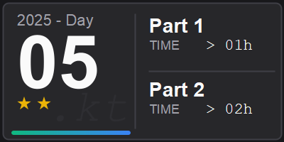</a> <br/>
        <a href="src/main/kotlin/tr/emreone/adventofcode/year2025/Day05.kt">Day05.kt</a> |
        <a href="src/test/kotlin/tr/emreone/adventofcode/year2025/Day05Test.kt">Day05Test.kt</a>
    </td>
  </tr>
  <tr>
    <td align="center">
        <a href="https://adventofcode.com/2025/day/6">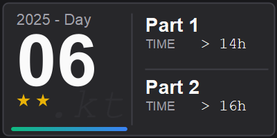</a> <br/>
        <a href="src/main/kotlin/tr/emreone/adventofcode/year2025/Day06.kt">Day06.kt</a> |
        <a href="src/test/kotlin/tr/emreone/adventofcode/year2025/Day06Test.kt">Day06Test.kt</a>
    </td>
    <td align="center">
        <a href="https://adventofcode.com/2025/day/7"></a> <br/>
        <a href="src/main/kotlin/tr/emreone/adventofcode/year2025/Day07.kt">Day07.kt</a> |
        <a href="src/test/kotlin/tr/emreone/adventofcode/year2025/Day07Test.kt">Day07Test.kt</a>
    </td>
    <td align="center">
        <a href="https://adventofcode.com/2025/day/8">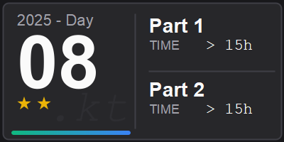</a> <br/>
        <a href="src/main/kotlin/tr/emreone/adventofcode/year2025/Day08.kt">Day08.kt</a> |
        <a href="src/test/kotlin/tr/emreone/adventofcode/year2025/Day08Test.kt">Day08Test.kt</a>
    </td>
    <td align="center">
        <a href="https://adventofcode.com/2025/day/9">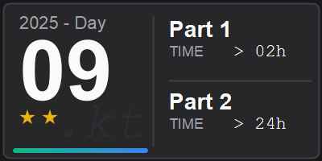</a> <br/>
        <a href="src/main/kotlin/tr/emreone/adventofcode/year2025/Day09.kt">Day09.kt</a> |
        <a href="src/test/kotlin/tr/emreone/adventofcode/year2025/Day09Test.kt">Day09Test.kt</a>
    </td>
    <td align="center">
        <a href="https://adventofcode.com/2025/day/10">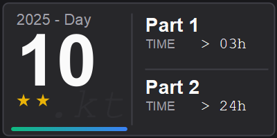</a> <br/>
        <a href="src/main/kotlin/tr/emreone/adventofcode/year2025/Day10.kt">Day10.kt</a> |
        <a href="src/test/kotlin/tr/emreone/adventofcode/year2025/Day10Test.kt">Day10Test.kt</a>
    </td>
  </tr>
  <tr>
     <td align="center">
        <a href="https://adventofcode.com/2025/day/11">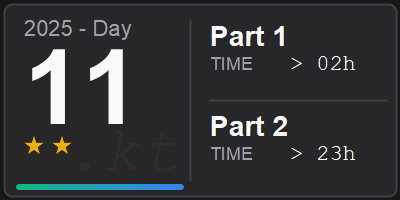</a> <br/>
        <a href="src/main/kotlin/tr/emreone/adventofcode/year2025/Day11.kt">Day11.kt</a> |
        <a href="src/test/kotlin/tr/emreone/adventofcode/year2025/Day11Test.kt">Day11Test.kt</a>
    </td>
    <td align="center">
        <a href="https://adventofcode.com/2025/day/12">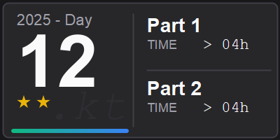</a> <br/>
        <a href="src/main/kotlin/tr/emreone/adventofcode/year2025/Day12.kt">Day12.kt</a> |
        <a href="src/test/kotlin/tr/emreone/adventofcode/year2025/Day12Test.kt">Day12Test.kt</a>
    </td>
  </tr>
</table>
<!-- AOC TILES END -->

---

## 🚀 Getting started

### Prerequisites

- **Kotlin** 1.9+
- **Java** 11+
- **Gradle** 8.5+

### Run Project

```bash
# Clone
git clone https://github.com/emre-one/advent-of-code.git
cd advent-of-code

# Run all tests
./gradlew test
```

---

## 📂 Project-Structure

```
advent-of-code/
├── aoc_tiles/                      # Generated Tiles
│   ├── 2015
│   ├── ...
│   └── 2025/
│       ├── 01.png
│       └── ...
└── src
    ├── main
    │   ├── kotlin/tr/emreone/adventofcode/
    │   │   ├── year2015
    │   │   ├── ...
    │   │   └── year2025/
    │   │       ├── Day01.kt        # Solution for Day 01
    │   │       ├── Day02.kt        # Solution for Day 02
    │   │       └── ...
    │   └── resources
    │       └── session.cookie      # AoC Session Cookie
    └── test
        ├── kotlin/tr/emreone/adventofcode/
        │   ├── year2015
        │   ├── ...
        │   └── year2025/
        │       ├── Day01Test.kt    # Tests for Day 01
        │       ├── Day02Test.kt    # Tests for Day 02
        │       └── ...
        └── resources
            ├── year2015
            ├── ...
            └── year2025/
                ├── day01_example.txt 
                ├── day02_example.txt
                └── ...
 
```

---

## Generate Tiles

To generate the tiles for the Advent of Code days, you need to provide your session cookie to access your personal input
data.

```bash
# save your session cookie (only once a year)
echo "YOUR_SESSION_COOKIE" > src/main/resources/session.cookie

# Generate tiles
kotlin AoCTileGenerator.kt
# or 
gradle generateAocTiles
```

## 🗓️ Calender previous Years

<details>
<summary>2024</summary>

<table align="center">
  <tr>
    <td align="center">
        <a href="https://adventofcode.com/2024/day/1">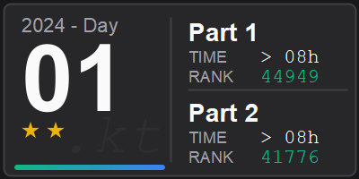</a> <br/>
        <a href="src/main/kotlin/tr/emreone/adventofcode/year2024/Day01.kt">Day01.kt</a> |
        <a href="src/test/kotlin/tr/emreone/adventofcode/year2024/Day01Test.kt">Day01Test.kt</a>
    </td>
    <td align="center">
        <a href="https://adventofcode.com/2024/day/2"></a> <br/>
        <a href="src/main/kotlin/tr/emreone/adventofcode/year2024/Day02.kt">Day02.kt</a> |
        <a href="src/test/kotlin/tr/emreone/adventofcode/year2024/Day02Test.kt">Day02Test.kt</a>
    </td>
    <td align="center">
        <a href="https://adventofcode.com/2024/day/3"></a> <br/>
        <a href="src/main/kotlin/tr/emreone/adventofcode/year2024/Day03.kt">Day03.kt</a> |
        <a href="src/test/kotlin/tr/emreone/adventofcode/year2024/Day03Test.kt">Day03Test.kt</a>
    </td>
    <td align="center">
        <a href="https://adventofcode.com/2024/day/4"></a> <br/>
        <a href="src/main/kotlin/tr/emreone/adventofcode/year2024/Day04.kt">Day04.kt</a> |
        <a href="src/test/kotlin/tr/emreone/adventofcode/year2024/Day04Test.kt">Day04Test.kt</a>
    </td>
    <td align="center">
        <a href="https://adventofcode.com/2024/day/5">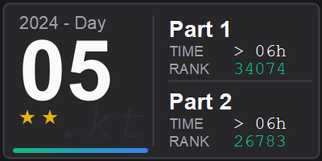</a> <br/>
        <a href="src/main/kotlin/tr/emreone/adventofcode/year2024/Day05.kt">Day05.kt</a> |
        <a href="src/test/kotlin/tr/emreone/adventofcode/year2024/Day05Test.kt">Day05Test.kt</a>
    </td>
  </tr>
  <tr>
    <td align="center">
        <a href="https://adventofcode.com/2024/day/6">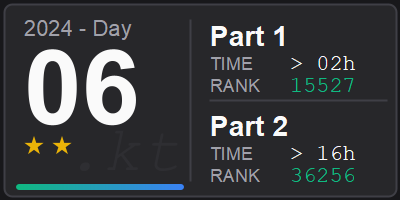</a> <br/>
        <a href="src/main/kotlin/tr/emreone/adventofcode/year2024/Day06.kt">Day06.kt</a> |
        <a href="src/test/kotlin/tr/emreone/adventofcode/year2024/Day06Test.kt">Day06Test.kt</a>
    </td>
    <td align="center">
        <a href="https://adventofcode.com/2024/day/7"></a> <br/>
        <a href="src/main/kotlin/tr/emreone/adventofcode/year2024/Day07.kt">Day07.kt</a> |
        <a href="src/test/kotlin/tr/emreone/adventofcode/year2024/Day07Test.kt">Day07Test.kt</a>
    </td>
    <td align="center">
        <a href="https://adventofcode.com/2024/day/8">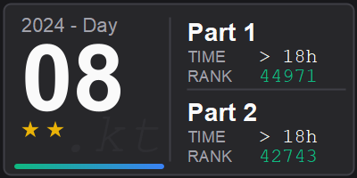</a> <br/>
        <a href="src/main/kotlin/tr/emreone/adventofcode/year2024/Day08.kt">Day08.kt</a> |
        <a href="src/test/kotlin/tr/emreone/adventofcode/year2024/Day08Test.kt">Day08Test.kt</a>
    </td>
    <td align="center">
        <a href="https://adventofcode.com/2024/day/9">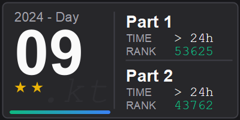</a> <br/>
        <a href="src/main/kotlin/tr/emreone/adventofcode/year2024/Day09.kt">Day09.kt</a> |
        <a href="src/test/kotlin/tr/emreone/adventofcode/year2024/Day09Test.kt">Day09Test.kt</a>
    </td>
    <td align="center">
        <a href="https://adventofcode.com/2024/day/10"></a> <br/>
        <a href="src/main/kotlin/tr/emreone/adventofcode/year2024/Day10.kt">Day10.kt</a> |
        <a href="src/test/kotlin/tr/emreone/adventofcode/year2024/Day10Test.kt">Day10Test.kt</a>
    </td>
  </tr>
  <tr>
     <td align="center">
        <a href="https://adventofcode.com/2024/day/11"></a> <br/>
        <a href="src/main/kotlin/tr/emreone/adventofcode/year2024/Day11.kt">Day11.kt</a> |
        <a href="src/test/kotlin/tr/emreone/adventofcode/year2024/Day11Test.kt">Day11Test.kt</a>
    </td>
    <td align="center">
        <a href="https://adventofcode.com/2024/day/12"></a> <br/>
        <a href="src/main/kotlin/tr/emreone/adventofcode/year2024/Day12.kt">Day12.kt</a> |
        <a href="src/test/kotlin/tr/emreone/adventofcode/year2024/Day12Test.kt">Day12Test.kt</a>
    </td>
    <td align="center">
        <a href="https://adventofcode.com/2024/day/13"></a> <br/>
        <a href="src/main/kotlin/tr/emreone/adventofcode/year2024/Day13.kt">Day13.kt</a> |
        <a href="src/test/kotlin/tr/emreone/adventofcode/year2024/Day13Test.kt">Day13Test.kt</a>
    </td>
    <td align="center">
        <a href="https://adventofcode.com/2024/day/14"></a> <br/>
        <a href="src/main/kotlin/tr/emreone/adventofcode/year2024/Day14.kt">Day14.kt</a> |
        <a href="src/test/kotlin/tr/emreone/adventofcode/year2024/Day14Test.kt">Day14Test.kt</a>
    </td>
    <td align="center">
        <a href="https://adventofcode.com/2024/day/15"></a> <br/>
        <a href="src/main/kotlin/tr/emreone/adventofcode/year2024/Day15.kt">Day15.kt</a> |
        <a href="src/test/kotlin/tr/emreone/adventofcode/year2024/Day15Test.kt">Day15Test.kt</a>
    </td>
  </tr>
  <tr>
     <td align="center">
        <a href="https://adventofcode.com/2024/day/16"></a> <br/>
        <a href="src/main/kotlin/tr/emreone/adventofcode/year2024/Day16.kt">Day16.kt</a> |
        <a href="src/test/kotlin/tr/emreone/adventofcode/year2024/Day16Test.kt">Day16Test.kt</a>
    </td>
    <td align="center">
        <a href="https://adventofcode.com/2024/day/17"></a> <br/>
        <a href="src/main/kotlin/tr/emreone/adventofcode/year2024/Day17.kt">Day17.kt</a> |
        <a href="src/test/kotlin/tr/emreone/adventofcode/year2024/Day17Test.kt">Day17Test.kt</a>
    </td>
    <td align="center">
        <a href="https://adventofcode.com/2024/day/18">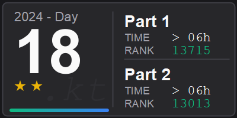</a> <br/>
        <a href="src/main/kotlin/tr/emreone/adventofcode/year2024/Day18.kt">Day18.kt</a> |
        <a href="src/test/kotlin/tr/emreone/adventofcode/year2024/Day18Test.kt">Day18Test.kt</a>
    </td>
    <td align="center">
        <a href="https://adventofcode.com/2024/day/19"></a> <br/>
        <a href="src/main/kotlin/tr/emreone/adventofcode/year2024/Day19.kt">Day19.kt</a> |
        <a href="src/test/kotlin/tr/emreone/adventofcode/year2024/Day19Test.kt">Day19Test.kt</a>
    </td>
    <td align="center">
        <a href="https://adventofcode.com/2024/day/20">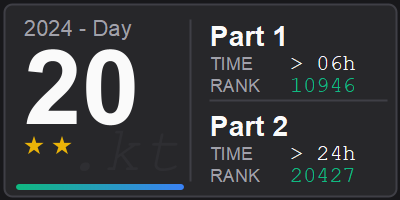</a> <br/>
        <a href="src/main/kotlin/tr/emreone/adventofcode/year2024/Day20.kt">Day20.kt</a> |
        <a href="src/test/kotlin/tr/emreone/adventofcode/year2024/Day20Test.kt">Day20Test.kt</a>
    </td>
  </tr>
  <tr>
     <td align="center">
        <a href="https://adventofcode.com/2024/day/21">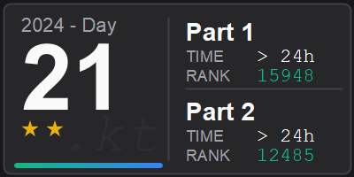</a> <br/>
        <a href="src/main/kotlin/tr/emreone/adventofcode/year2024/Day21.kt">Day21.kt</a> |
        <a href="src/test/kotlin/tr/emreone/adventofcode/year2024/Day21Test.kt">Day21Test.kt</a>
    </td>
    <td align="center">
        <a href="https://adventofcode.com/2024/day/22"></a> <br/>
        <a href="src/main/kotlin/tr/emreone/adventofcode/year2024/Day22.kt">Day22.kt</a> |
        <a href="src/test/kotlin/tr/emreone/adventofcode/year2024/Day22Test.kt">Day22Test.kt</a>
    </td>
    <td align="center">
        <a href="https://adventofcode.com/2024/day/23"></a> <br/>
        <a href="src/main/kotlin/tr/emreone/adventofcode/year2024/Day23.kt">Day23.kt</a> |
        <a href="src/test/kotlin/tr/emreone/adventofcode/year2024/Day23Test.kt">Day23Test.kt</a>
    </td>
    <td align="center">
        <a href="https://adventofcode.com/2024/day/24"></a> <br/>
        <a href="src/main/kotlin/tr/emreone/adventofcode/year2024/Day24.kt">Day24.kt</a> |
        <a href="src/test/kotlin/tr/emreone/adventofcode/year2024/Day24Test.kt">Day24Test.kt</a>
    </td>
    <td align="center">
        <a href="https://adventofcode.com/2024/day/25"></a> <br/>
        <a href="src/main/kotlin/tr/emreone/adventofcode/year2024/Day25.kt">Day25.kt</a> |
        <a href="src/test/kotlin/tr/emreone/adventofcode/year2024/Day25Test.kt">Day25Test.kt</a>
    </td>
  </tr>
</table>
</details>

<details>
<summary>2023</summary>

<table align="center">
  <tr>
    <td align="center">
        <a href="https://adventofcode.com/2023/day/1"></a> <br/>
        <a href="src/main/kotlin/tr/emreone/adventofcode/year2023/Day01.kt">Day01.kt</a> |
        <a href="src/test/kotlin/tr/emreone/adventofcode/year2023/Day01Test.kt">Day01Test.kt</a>
    </td>
    <td align="center">
        <a href="https://adventofcode.com/2023/day/2"></a> <br/>
        <a href="src/main/kotlin/tr/emreone/adventofcode/year2023/Day02.kt">Day02.kt</a> |
        <a href="src/test/kotlin/tr/emreone/adventofcode/year2023/Day02Test.kt">Day02Test.kt</a>
    </td>
    <td align="center">
        <a href="https://adventofcode.com/2023/day/3"></a> <br/>
        <a href="src/main/kotlin/tr/emreone/adventofcode/year2023/Day03.kt">Day03.kt</a> |
        <a href="src/test/kotlin/tr/emreone/adventofcode/year2023/Day03Test.kt">Day03Test.kt</a>
    </td>
    <td align="center">
        <a href="https://adventofcode.com/2023/day/4"></a> <br/>
        <a href="src/main/kotlin/tr/emreone/adventofcode/year2023/Day04.kt">Day04.kt</a> |
        <a href="src/test/kotlin/tr/emreone/adventofcode/year2023/Day04Test.kt">Day04Test.kt</a>
    </td>
    <td align="center">
        <a href="https://adventofcode.com/2023/day/5"></a> <br/>
        <a href="src/main/kotlin/tr/emreone/adventofcode/year2023/Day05.kt">Day05.kt</a> |
        <a href="src/test/kotlin/tr/emreone/adventofcode/year2023/Day05Test.kt">Day05Test.kt</a>
    </td>
  </tr>
  <tr>
    <td align="center">
        <a href="https://adventofcode.com/2023/day/6"></a> <br/>
        <a href="src/main/kotlin/tr/emreone/adventofcode/year2023/Day06.kt">Day06.kt</a> |
        <a href="src/test/kotlin/tr/emreone/adventofcode/year2023/Day06Test.kt">Day06Test.kt</a>
    </td>
    <td align="center">
        <a href="https://adventofcode.com/2023/day/7">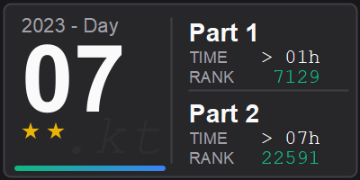</a> <br/>
        <a href="src/main/kotlin/tr/emreone/adventofcode/year2023/Day07.kt">Day07.kt</a> |
        <a href="src/test/kotlin/tr/emreone/adventofcode/year2023/Day07Test.kt">Day07Test.kt</a>
    </td>
    <td align="center">
        <a href="https://adventofcode.com/2023/day/8"></a> <br/>
        <a href="src/main/kotlin/tr/emreone/adventofcode/year2023/Day08.kt">Day08.kt</a> |
        <a href="src/test/kotlin/tr/emreone/adventofcode/year2023/Day08Test.kt">Day08Test.kt</a>
    </td>
    <td align="center">
        <a href="https://adventofcode.com/2023/day/9"></a> <br/>
        <a href="src/main/kotlin/tr/emreone/adventofcode/year2023/Day09.kt">Day09.kt</a> |
        <a href="src/test/kotlin/tr/emreone/adventofcode/year2023/Day09Test.kt">Day09Test.kt</a>
    </td>
    <td align="center">
        <a href="https://adventofcode.com/2023/day/10"></a> <br/>
        <a href="src/main/kotlin/tr/emreone/adventofcode/year2023/Day10.kt">Day10.kt</a> |
        <a href="src/test/kotlin/tr/emreone/adventofcode/year2023/Day10Test.kt">Day10Test.kt</a>
    </td>
  </tr>
  <tr>
     <td align="center">
        <a href="https://adventofcode.com/2023/day/11"></a> <br/>
        <a href="src/main/kotlin/tr/emreone/adventofcode/year2023/Day11.kt">Day11.kt</a> |
        <a href="src/test/kotlin/tr/emreone/adventofcode/year2023/Day11Test.kt">Day11Test.kt</a>
    </td>
    <td align="center">
        <a href="https://adventofcode.com/2023/day/12">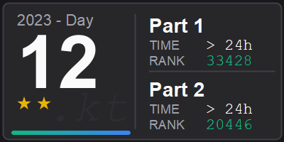</a> <br/>
        <a href="src/main/kotlin/tr/emreone/adventofcode/year2023/Day12.kt">Day12.kt</a> |
        <a href="src/test/kotlin/tr/emreone/adventofcode/year2023/Day12Test.kt">Day12Test.kt</a>
    </td>
    <td align="center">
        <a href="https://adventofcode.com/2023/day/13"></a> <br/>
        <a href="src/main/kotlin/tr/emreone/adventofcode/year2023/Day13.kt">Day13.kt</a> |
        <a href="src/test/kotlin/tr/emreone/adventofcode/year2023/Day13Test.kt">Day13Test.kt</a>
    </td>
    <td align="center">
        <a href="https://adventofcode.com/2023/day/14">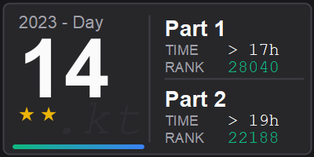</a> <br/>
        <a href="src/main/kotlin/tr/emreone/adventofcode/year2023/Day14.kt">Day14.kt</a> |
        <a href="src/test/kotlin/tr/emreone/adventofcode/year2023/Day14Test.kt">Day14Test.kt</a>
    </td>
    <td align="center">
        <a href="https://adventofcode.com/2023/day/15"></a> <br/>
        <a href="src/main/kotlin/tr/emreone/adventofcode/year2023/Day15.kt">Day15.kt</a> |
        <a href="src/test/kotlin/tr/emreone/adventofcode/year2023/Day15Test.kt">Day15Test.kt</a>
    </td>
  </tr>
  <tr>
     <td align="center">
        <a href="https://adventofcode.com/2023/day/16"></a> <br/>
        <a href="src/main/kotlin/tr/emreone/adventofcode/year2023/Day16.kt">Day16.kt</a> |
        <a href="src/test/kotlin/tr/emreone/adventofcode/year2023/Day16Test.kt">Day16Test.kt</a>
    </td>
    <td align="center">
        <a href="https://adventofcode.com/2023/day/17"></a> <br/>
        <a href="src/main/kotlin/tr/emreone/adventofcode/year2023/Day17.kt">Day17.kt</a> |
        <a href="src/test/kotlin/tr/emreone/adventofcode/year2023/Day17Test.kt">Day17Test.kt</a>
    </td>
    <td align="center">
        <a href="https://adventofcode.com/2023/day/18"></a> <br/>
        <a href="src/main/kotlin/tr/emreone/adventofcode/year2023/Day18.kt">Day18.kt</a> |
        <a href="src/test/kotlin/tr/emreone/adventofcode/year2023/Day18Test.kt">Day18Test.kt</a>
    </td>
    <td align="center">
        <a href="https://adventofcode.com/2023/day/19"></a> <br/>
        <a href="src/main/kotlin/tr/emreone/adventofcode/year2023/Day19.kt">Day19.kt</a> |
        <a href="src/test/kotlin/tr/emreone/adventofcode/year2023/Day19Test.kt">Day19Test.kt</a>
    </td>
    <td align="center">
        <a href="https://adventofcode.com/2023/day/20"></a> <br/>
        <a href="src/main/kotlin/tr/emreone/adventofcode/year2023/Day20.kt">Day20.kt</a> |
        <a href="src/test/kotlin/tr/emreone/adventofcode/year2023/Day20Test.kt">Day20Test.kt</a>
    </td>
  </tr>
  <tr>
     <td align="center">
        <a href="https://adventofcode.com/2023/day/21"></a> <br/>
        <a href="src/main/kotlin/tr/emreone/adventofcode/year2023/Day21.kt">Day21.kt</a> |
        <a href="src/test/kotlin/tr/emreone/adventofcode/year2023/Day21Test.kt">Day21Test.kt</a>
    </td>
    <td align="center">
        <a href="https://adventofcode.com/2023/day/22"></a> <br/>
        <a href="src/main/kotlin/tr/emreone/adventofcode/year2023/Day22.kt">Day22.kt</a> |
        <a href="src/test/kotlin/tr/emreone/adventofcode/year2023/Day22Test.kt">Day22Test.kt</a>
    </td>
    <td align="center">
        <a href="https://adventofcode.com/2023/day/23">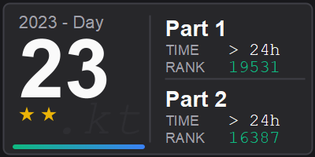</a> <br/>
        <a href="src/main/kotlin/tr/emreone/adventofcode/year2023/Day23.kt">Day23.kt</a> |
        <a href="src/test/kotlin/tr/emreone/adventofcode/year2023/Day23Test.kt">Day23Test.kt</a>
    </td>
    <td align="center">
        <a href="https://adventofcode.com/2023/day/24"></a> <br/>
        <a href="src/main/kotlin/tr/emreone/adventofcode/year2023/Day24.kt">Day24.kt</a> |
        <a href="src/test/kotlin/tr/emreone/adventofcode/year2023/Day24Test.kt">Day24Test.kt</a>
    </td>
    <td align="center">
        <a href="https://adventofcode.com/2023/day/25"></a> <br/>
        <a href="src/main/kotlin/tr/emreone/adventofcode/year2023/Day25.kt">Day25.kt</a> |
        <a href="src/test/kotlin/tr/emreone/adventofcode/year2023/Day25Test.kt">Day25Test.kt</a>
    </td>
  </tr>
</table>
</details>

---

## 📊 Statistics

| Kategorie                | Wert        |
|--------------------------|-------------|
| **Total Stars**          | ⭐ 286 / 524 |
| **Finished Days**        | 143 / 262   |
| **Number of Code lines** | ~0          |

---

## 🛠️ Tech-Stack

- **Language:** Kotlin 1.9
- **Build-Tool:** Gradle
- **Testing:** JUnit 5
- **Utils:** Kotlin stdlib, Kotlin-Utils (my own library)
- **Visualisation:** Java2D for Tiles-Generation

---

## 🔗 Links

- 🎄 [Advent of Code](https://adventofcode.com)
- 🐦 [AoC auf Twitter](https://twitter.com/adventofcode)
- 💬 [AoC Subreddit](https://reddit.com/r/adventofcode)

---

## 📝 Lizenz

MIT [LICENSE](LICENSE)

---

<div align="center">

**Viel Spaß beim Coden! **

Made with ❤️ and ☕ in Ankara, 🇹🇷

[](https://github.com/emre-one/advent-of-code)

</div>

<!-- 

<details>
<summary>Title</summary>

body
</details>

> [!NOTE]
> Useful information that users should know, even when skimming content.

> [!TIP]
> Helpful advice for doing things better or more easily.

> [!IMPORTANT]
> Key information users need to know to achieve their goal.

> [!WARNING]
> Urgent info that needs immediate user attention to avoid problems.

> [!CAUTION]
> Advises about risks or negative outcomes of certain actions.
-->
